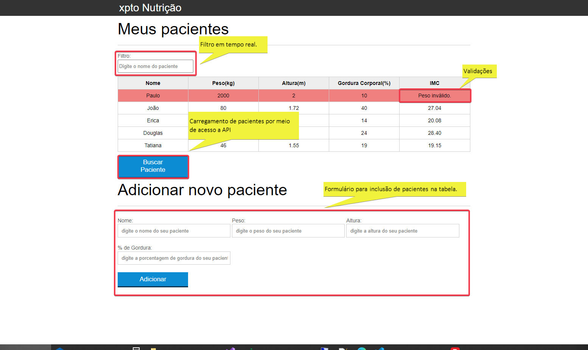
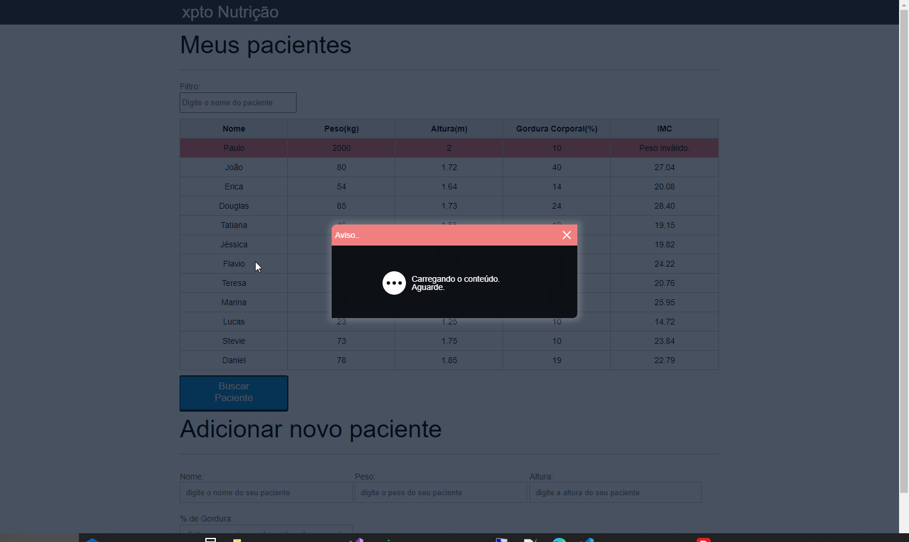
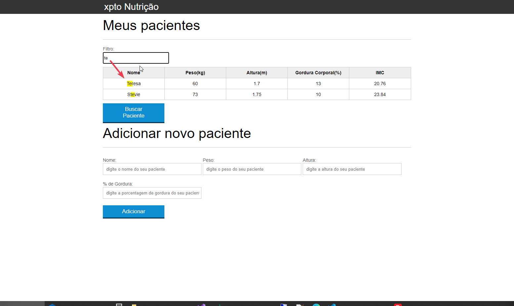

# Projeto xptoNutricao
Projeto javascript para estudo. Conteúdo: Funções javascript, utilização de ajax e manipulação de objetos no DOM

## O que é?
Projeto em javascript e html que simula um cadastro de pacientes de um nutricionista. Faz cálculo de imc.

#### Página Principal

#### Busca de pacientes via api

#### Filtro por nome de usuário

## Por que utilizar?
fonte de estudo.
1. Html5
2. CSS
3. Javascript (front-end e back-end)
4. Node.js
5. SQLite 3 
 
## Como utilizar
Recomendação: Utilizar o vsCode.
abrir o arquivo "index.html"

1. Baixar o projeto
2. No terminal do vsCode utilizar o comando do npm: npm start (Favor validar e informar quaisquer dificuldades)